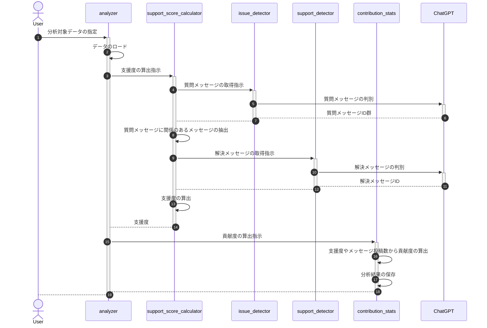

## 目次  <!-- omit in toc -->
- [1. 概要](#1-概要)
- [2. 処理フロー](#2-処理フロー)
- [3. プロンプト概要](#3-プロンプト概要)
  - [3.1. プロンプト定義](#31-プロンプト定義)
  - [3.2. 工夫点](#32-工夫点)
- [4. 支援度の精度概要](#4-支援度の精度概要)
  - [4.1. テストデータ](#41-テストデータ)
  - [4.2. 精度](#42-精度)
- [5. コスト](#5-コスト)
- [6. コミュニティ貢献度の評価観点に関して](#6-コミュニティ貢献度の評価観点に関して)
  - [6.1. メッセージ投稿数/リアクション数](#61-メッセージ投稿数リアクション数)
  - [6.2. 有益度](#62-有益度)
  - [6.3. 参加度](#63-参加度)
  - [6.4. 支援度](#64-支援度)
  - [6.5. 違反度](#65-違反度)
- [7. 貢献度の評価結果](#7-貢献度の評価結果)
- [8. システム概要](#8-システム概要)
  - [8.1. フォルダ構成](#81-フォルダ構成)
  - [8.2. Setup](#82-setup)
  - [8.3. Usage](#83-usage)


## 1. 概要
- SNSの会話データからコミュニティの貢献度をChatGPTを使って算出する。
- [データ構造](doc/データ構造.md)に従って会話データを保存することで貢献度の算出が可能。
- 現状DiscordAPIから取得した会話データに対応している。
- 貢献度はいくつかの観点をもとに算出する（後述の[コミュニティ貢献度の評価観点に関して](#6-コミュニティ貢献度の評価観点に関して)参照）。
- 貢献度の観点の一つとして支援度を定義。ChatGPTを用いてコミュニティメンバーの困り事を解決した回数を支援度として算出する。

## 2. 処理フロー


## 3. プロンプト概要
### 3.1. プロンプト定義
- [issue_detector_prompt.py](app/issue_detector_prompt.py)
  - 困り事（質問メッセージ）の判別に利用
- [support_detector_prompt.py](app/support_detector_prompt.py)
  - 解決メッセージの判別に利用
### 3.2. 工夫点
- 判別例をプロンプト内で提示（Few-shot prompting）することで以下を実現。
  - 精度改善
  - 複数会話の中から質問メッセージをすべて検出することでコストの抑制（単に1会話から質問 or notを判別するわけではない）
  - ChatGPTのアウトプットとしてメッセージIDとメッセージを期待するフォーマットで出力
- 解決メッセージ判別処理にインプットするメッセージを制限。
  - 質問メッセージ以降の全メッセージを連携するとトークン数の上限に抵触、さらにコストが問題となる
  - 質問メッセージに紐づくメッセージ及び直近の数会話のみをインプットとした（質問メッセージに対してリプライする形でメッセージを送信した場合、コミュニケーションツールのAPIから紐付きを解決可能）
- QA（困り事、解決メッセージ）のペアを保存。
  - QAのペアを保存することでQAボットへの活用が可能
  - QAペアをFew-shot promptingに利用することで精度改善を期待

## 4. 支援度の精度概要
コミュニティメンバーの困り事を解決した回数（ChatGPTでQAの会話から困り事を解決したメッセージを抽出する）が正しく算出できているか確認を行った。

### 4.1. テストデータ
- 取得元
  - Discordサーバ「AKINDO」のAI+CRYPTO HACKATHONの「free-talk」「faq」チャンネルの会話
- 取得期間
  - 2023/06/17までに投稿された会話（43件）
### 4.2. 精度
困り事メッセージを判別した後、誤検知したメッセージも含めて解決メッセージの判別を実施。  
困り事メッセージの判別で誤検知率が高いが解決メッセージが判別できないため最終的な精度（解決メッセージ判別精度）の誤検知率は低くなっている。
- 困り事（質問）メッセージの判別精度
  - 正解率
    - 79% = 34 / 43 * 100
  - 見逃し率（1 - recall）
    - 20% = (1 - 4 / 5) * 100
  - 誤検知率（1 - precision）
    - 67% = (1 - 4 / 12) * 100
- 解決メッセージの判別精度
  - 正解率
    - 98% = 42 / 43 * 100
  - 見逃し率（1 - recall）
    - 20% = (1 - 4 / 5) * 100
  - 誤検知率（1 - precision）
    - 0% = (1 - 4 / 4) * 100


詳細は[issue_detector](report/issue_detector/README.md), [support_score](report/support_score/README.md)参照。


## 5. コスト
支援度算出の過程でChatGPTで扱ったtoken数が監視できるようロギングしている。  
上述のテストデータを用いて支援度を算出した場合のtoken数は約18,846。  
詳細は[cost](report/cost)参照。  
参考：ChatGPT（gpt-3.5-turbo） APIの2023年6月時点のコストは0.002ドル/1000token  


## 6. コミュニティ貢献度の評価観点に関して
以下の評価指標に基づいてスコアを算出し、任意の係数で重み付けした合計を貢献度とする。

### 6.1. メッセージ投稿数/リアクション数
- 概要
  - コミュニティ内での発言数が多いユーザは、一般的には活発にコミュニケーションを行っていると考えられる。ただし、発言の内容も重要なので単に発言回数だけでなく後述の評価観点と組み合わせて貢献度を評価する。
- 評価指標
  - メッセージ投稿回数、リアクション数

### 6.2. 有益度
- 概要
  - ユーザが投稿したメッセージが他のメンバーからの反応を引き出しているかどうかを評価する。
- 評価指標
  - メッセージに対してのリアクション（絵文字など）数、返信数から算出する。

### 6.3. 参加度
- 概要
- コミュニティ内で開催されるイベントやミーティングにどれだけ積極的に参加しているかを評価する。
- 評価指標
  - イベント参加回数

### 6.4. 支援度
- 概要
  - ユーザが他のメンバーの質問に答えたり、新規メンバーを歓迎したり、問題が発生したときに解決を助けたりといった行動をとった場合に評価する。
- 評価指標
  - 他のメンバーの困り事を解決した回数（ChatGPTでQAの会話から困り事を解決したメッセージを抽出する）

### 6.5. 違反度
- 概要
  - ユーザがコミュニティのルールを遵守していて、他のユーザを尊重し、健全なコミュニケーションを促進しているかどうかを評価する。
  - 違反度が高いとネガティブ評価となる。
- 評価指標
  - 悪意（暴力・差別・アダルトなど）のある表現を使った回数（ChatGPTで悪意のある表現を抽出する）

## 7. 貢献度の評価結果
- 当該システムで分析した結果は以下のフォーマットでファイル出力を行う。
  - ランキング
    - ファイル名：```ranking_${rankingId}.json```
    - カラム名：[データ構造](doc/データ構造.md)のランキング 参照
  - ランキングユーザ詳細
    - ファイル名：```user_${userId}_${rankingId}.json```
    - カラム名：[データ構造](doc/データ構造.md)のランキングユーザ詳細 参照

## 8. システム概要
### 8.1. フォルダ構成
- [app](app)
  - 貢献度算出用のプログラムを配置。
- [data](data)
  - 貢献度算出対象のデータを配置。Discordから取得した会話データを配置する。
  - 各Discordサーバのデータ管理ポリシーに関わるためgithubにはアップロードしない。
- [doc](doc)
  - 貢献度算出に関連する仕様を配置。
- [report](report)
  - 分析レポートを配置。ChatGPTを使った貢献度算出における精度を記載。
- [result](result):
  - 貢献度算出結果を配置。
  - 各Discordサーバのデータ管理ポリシーに関わるためgithubにはアップロードしない。
- [scripts](scripts)
  - 主にappフォルダのプログラムを利用するためのツールを配置。
- [tests](tests)
  - テストコードを配置。
- root
  - READMEや環境構築に必要なファイル群を配置。


### 8.2. Setup
```
pyenv install 3.11.3
pyenv local 3.11.3
poetry env use python
poetry shell
poetry install
```

### 8.3. Usage
```
# https://platform.openai.com/account/api-keys から APIキーを取得
export OPENAI_API_KEY=${API KEY}
PYTHONPATH=./ python analyze.py
```